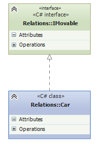

# Костины вопросики

> [!IMPORTANT]
> Первая цифра у вопроса - номер группы, вторая - номер вопроса из группы.
> 
> `Например: 1.5 означает, что это 5 вопрос из 1 группы вопросов.`

## 1.5 Что такое интерфейс класса?
**Интерфейс** – внешний вид класса, скрывающий структуру и особенности
его поведения. 
> Другими словами, **интерфейс** – это все открытые члены
класса *(открытые поля и объявления методов)*. Клиентский код может
взаимодействовать с объектом только через его интерфейс – те поля и
методы, которые будут доступны извне класса.

### Пример 1.5
```c#
public class Person
{
    private static int IdCounter {get; set;} = 0;

    public int Id {get;}

    public string Name {get; set;} = string.Empty;

    public int Age {get; set;}

    public Person(int age)
    {
        Id = IdCounter;
        Age = age;
        IdCounter++;
    }

    public Person(string name, int age)
    {
        Id = IdCounter;
        Name = name;
        Age = age;
        IdCounter++;
    }
}

void Demo()
{
    var person = new Person("Pavel", 25);

    person.Id; // Доступ ЕСТЬ - это часть интерфейса класса
    person.IdCounter // Доступа НЕТ - это часть реализации класса
}
```

## 1.6 Что такое реализация класса?
**Реализация** – внутренний вид класса, скрывающий секретные особенности
его поведения. Реализация состоит, в основном, из `закрытых полей и
методов, а также реализации всех методов`. [Пример см. в пункте 1.5](#пример-15).


## 1.9 Что такое сеттеры? Для чего они нужны?
**Сеттер** - это такая конструкция, которая должна проверять
входное значение и присваивать
значение в поле, не нарушая
защищенность (закрытость) полей внутри класса. Ключевое слово для сеттера - `set`. 

Сеттеры используются в **свойствах** - механизме, позволяющим предоставить ограниченный доступ
к полям объекта, защитив их от неправильного использования и обеспечив
целостность данных.

### Пример 1.9
```c#
public class Product
{
    private double _price;

    public double Price // Свойство
    {
        get // Геттер
        {
            return _price;
        }
        set // Сеттер
        {
            if (value < 0.0) // Проверка входного значения
            {
                throw new ArgumentException();
            }

            _price = value;
        }
    }
}
```

## 1.10 Что такое геттеры? Для чего они нужны?
**Геттер** - это такая конструкцию, которая должна возвращать
значение поля. С помощью ключевого слова `get` мы сможем получать
значения полей в клиентском коде, не нарушая
защищенность (закрытость) полей внутри класса. [Пример см. в пункте 1.9](#пример-19).

Геттеры используются в **свойствах** - механизме, позволяющим предоставить ограниченный доступ
к полям объекта, защитив их от неправильного использования и обеспечив
целостность данных.

## 2.9 Объясните принцип вызова конструкторов классов при создании объекта дочернего класса. Покажите пример кода
При создании объекта дочернего класса будет рекурсивно вызываться конструктор(ы) родительского класса. 

> Как показано в примере (см. пример 2.9): чтобы создать объект `класса C` вызовется конструктор `класса B`, но так как он сам является дочерним классом, то следом вызовется конструктор `класса A`. После того, как конструктор `класса A` исполнится, вызовется конструктор `класса B`, а затем конструктор `класса C` *(рекурсия распуталась)*.

### Пример 2.9
```c#
public class A
{
    public A()
    {
        Console.WriteLine("Конструктор класса A");
    }
}

public class B : A
{
    public B()
    {
        Console.WriteLine("Конструктор класса B");
    }
}

public class C : B
{
    public C()
    {
        Console.WriteLine("Конструктор класса C");
    }
}

void Demo()
{
    C c = new C();
}

/// Вывод:
/// Конструктор класса A
/// Конструктор класса B
/// Конструктор класса C
```

## 3.4 Как обозначается полиморфизм на диаграммах классов?

### Пример 3.4 диаграмма классов


### Пример 3.4 код *[(взято с metanit)](https://metanit.com/sharp/patterns/1.2.php)*
```c#
public interface IMovable
{
    void Move();
}

public class Car : IMovable
{
    public void Move()
    {
        Console.WriteLine("Машина едет");
    }
}
```

## 3.5 Что такое сервисный класс? Что такое статический класс?
**Сервисный класс** – это класс, который предоставляет функциональность, которая не принадлежит какому-либо конкретному объекту. Этот класс обычно содержит методы для выполнения определенных операций или обработки данных *(Например класс `Math`)*.

**Статический класс** – это класс, который содержит только статические члены *(методы, свойства, поля)*. Он не может быть инстанциирован, т.е. создан экземпляр объекта этого класса. Статические классы обычно используются для хранения утилитарных методов или констант.

## 3.12 Что такое обработчик события? Приведите пример обработчика события и его подписки на событие
**Обработчик событий** - это специальный метод, который вызывается, когда произойдет событие(я), на которое(ые) подписан данный обработчик. 

### Пример 3.12
```c#
public class Product
{
    public delegate void ProductEvent();

    public event ProductEvent CostChanged;

    private int _cost;

    public int Cost
    {
        get
        {
            return _cost;
        }
        set
        {
            if (value < 0)
            {
                throw new ArgumentException();
            }
            _cost = value;

            // проверка на null обязательна - это проверка,
            // что на событие кто-то подписан
            CostChanged?.Invoke();
        }
    }

    //...
}

public class Demo
{
    // наш обработчик, который должен срабатывать,
    // когда зажигается событие
    private void Product_CostChanged()
    {
        MessageBox.Show("Цена изменилась");
    }

    public void TestEvent()
    {
        // создаём объект продукта, на который подпишемся
        var product = new Product();
        // подписываемся на событие изменения цены
        product.CostChanged += Product_CostChanged;
        // меняем стоимость, чтобы спровоцировать
        // зажигание события
        product.Cost = 1000;
        product.Cost = 500;
        product.Cost = 700;
        // три изменения стоимости ->
        // три срабатывания обработчика ->
        // три показа всплывающего окна
    }
}
```