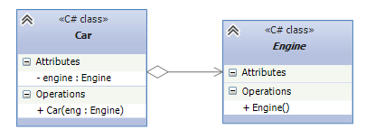
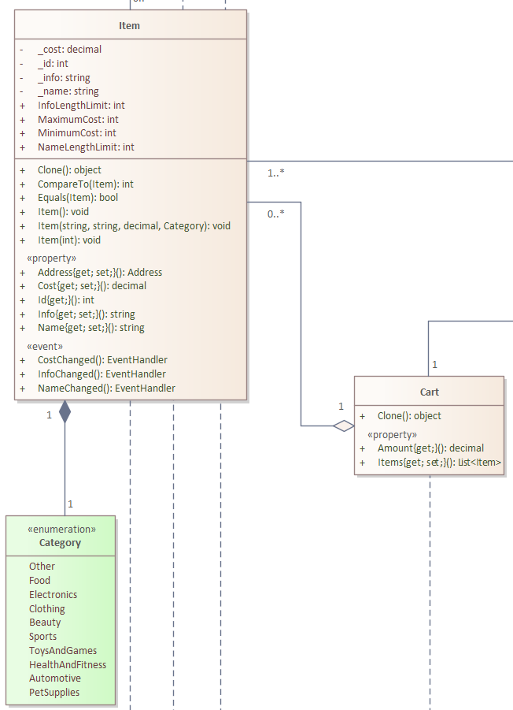
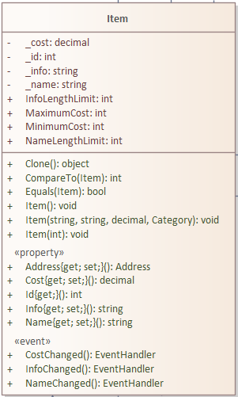
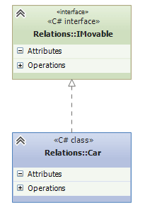

# Репозиторий для ответов на экзамен по ООП

Легенда, которому не лень делать README: **Полушвайко Константин Николаевич**

> [!IMPORTANT]
> Первая цифра у вопроса - номер группы, вторая - номер вопроса из группы. 
>
> `Например: 1.5 означает, что это 5 вопрос из 1 группы вопросов.`

## 0.1 Что такое инкапсуляция? Приведите пример кода
**Инкапсуляция** – свойство системы, позволяющее объединить в едином
описании состояние и поведение объекта с сокрытием его реализации.
Фактически, механизм инкапсуляции позволяет создавать классы, помещая
поля и методы в единую уникальную область видимости.

> **Сокрытие реализации** – принцип проектирования, заключающийся в
разграничении доступа различных частей программы к внутренним
компонентам друг друга. 
> Применимо к ООП, это предоставление доступа к членам класса по
средством модификаторов доступа: `private`, `public` и `protected`.
>
> **Состояние** – это перечень всех *(как правило, статических)* свойств данного
объекта и текущих *(как правило, динамических)* значений каждого из этих
свойств. Проще говоря, состояние – это все поля объекта и их текущее
значение.
>
> **Поведение** – это действия и реакции объекта, выраженные через
изменения состояния объекта и передачу сообщений. Проще говоря,
поведение – это все методы класса. Вызывая методы объекта, мы можем
менять его состояние. Таким образом, состояние объекта представляет
собой суммарный результат его поведения.

### Пример 0.1
```c#
public class Person
{
    // При помощи механизма инкапсуляции, 
    // мы поместили поля и методы (свойства) в единую уникальную 
    // область видимости
    private string _name;
    private string _surname;
    private int _age;

    public string Name {get {...} set {...}}
    public string Surname {get {...} set {...}}
    public int Age {get {...} set {...}}
}
```

## 0.2 Что такое наследование? Приведите пример кода
**Наследование** – это свойство системы, позволяющее описать новый класс на основе уже
существующего с частично или полностью заимствующейся
функциональностью.

> Дочерний класс расширяет функциональность базового класса.
Сам механизм наследования позволяет избавиться от дублирования кода в
классах, описывающих объекты, которые являются разновидностью более
общей абстракции


### Пример 0.2
```c#
public class Person
{
    private string _name;
    private string _surname;
    private int _age;

    public string Name {get {...} set {...}}
    public string Surname {get {...} set {...}}
    public int Age {get {...} set {...}}
}

public class Student : Person
{
    private int _id;
    public int Id {get {...} set {...}}
    public Student(...) {...}
}

public void Demo()
{
    var person = new Person();
    var student = new Student();

    // У student есть как свои поля, так и поля родительского класса person
    student.Name;
    student.Id;

    // ОШИБКА, у person есть свои поля, но нет полей дочернего класса student
    person.Id;
}
```

## 0.3 Что такое полиморфизм? Приведите пример кода
**Полиморфизм** – возможность работы с объектами разных
типов через общий интерфейс, но без
знания о том, объект какого типа
скрывается за интерфейсом.

> Классы, реализующие общий интерфейс,
называются полиморфными классами.

### Пример 0.3
```c#
public class Person
{
    private string _name;
    private string _surname;
    private int _age;

    public string Name {get {...} set {...}}
    public string Surname {get {...} set {...}}
    public int Age {get {...} set {...}}

    public virtual void ShowInfo()
    {
        Console.WriteLine($"{Name} {Surname}, {Age} old.");
    }
}

public class Student : Person
{
    private int _id;
    public int Id {get {...} set {...}}
    public Student(...) {...}

    public override void ShowInfo()
    {
        Console.WriteLine($"{Name} {Surname}, {Age} old, {Id} student ID.");
    }
}

public void Demo()
{
    var person = new Person();
    person.ShowInfo();
    // Вызовется ShowInfo() класса Person

    person = new Student();
    person.ShowInfo();
    // Вызовется ShowInfo() класса Student
}
```

## 1.1 Что такое класс?
**Класс** - это определяемый пользователем тип, состоящий из полей
данных *(часто называемых переменными-членами)* и членов, которые
оперируют полями данных *(к ним относятся конструкторы, свойства, методы,
события и т.д.)*.

### Пример 1.1
```c#
public class Person
{
    private string _name;
    private string _surname;
    private int _age;

    public string Name {get {...} set {...}}
    public string Surname {get {...} set {...}}
    public int Age {get {...} set {...}}


    public override void ShowInfo()
    {
        Console.WriteLine($"{Name} {Surname}, {Age} old.");
    }
}
```

## 1.2 Что такое объект класса?
**Объект класса** - это экземпляр класса, созданный на основе его описания
*(класса)*. Он имеет свое собственное **состояние** *(поля)* и может выполнять
определенные действия *(методы)*, определенные в классе.

> **Состояние** - это это перечень всех *(как правило, статических)* свойств
данного объекта и текущих *(как правило, динамических)* значений каждого из
этих свойств. Проще говоря, состояние – это все поля объекта и их текущее
значение.

## 1.3 Что такое модификатор доступа?
**Модификатор доступа** - это ключевое слово, которое определяет уровень
доступности к членам класса *(полям, методам, свойствам)*. В C# есть
несколько модификаторов доступа: `public`, `private`, `protected`, `internal` и `protected internal`.

## 1.4 Что такое сокрытие реализации?
**Сокрытие реализации** – принцип проектирования, заключающийся в
разграничении доступа различных частей программы к внутренним
компонентам друг друга

## 1.5 Что такое интерфейс класса?
**Интерфейс** – внешний вид класса, скрывающий структуру и особенности
его поведения. 
> Другими словами, **интерфейс** – это все открытые члены
класса *(открытые поля и объявления методов)*. Клиентский код может
взаимодействовать с объектом только через его интерфейс – те поля и
методы, которые будут доступны извне класса.

### Пример 1.5
```c#
public class Person
{
    private static int IdCounter {get; set;} = 0;

    public int Id {get;}

    public string Name {get; set;} = string.Empty;

    public int Age {get; set;}

    public Person(int age)
    {
        Id = IdCounter;
        Age = age;
        IdCounter++;
    }

    public Person(string name, int age)
    {
        Id = IdCounter;
        Name = name;
        Age = age;
        IdCounter++;
    }
}

void Demo()
{
    var person = new Person("Pavel", 25);

    person.Id; // Доступ ЕСТЬ - это часть интерфейса класса
    person.IdCounter // Доступа НЕТ - это часть реализации класса
}
```

## 1.6 Что такое реализация класса?
**Реализация** – внутренний вид класса, скрывающий секретные особенности
его поведения. Реализация состоит, в основном, из `закрытых полей и
методов, а также реализации всех методов`. [Пример см. в пункте 1.5](#пример-15).

## 1.7 Что такое состояние класса?
**Состояние класса** – это перечень всех (как правило, статических) свойств
данного объекта и текущих (как правило, динамических) значений каждого из
этих свойств. Проще говоря, состояние – это все поля объекта и их текущее
значение.

## 1.8 Что такое поведение класса?
**Поведение класса** – это действия и реакции объекта, выраженные через
изменения состояния объекта и передачу сообщений. Проще говоря,
поведение – это все методы класса. Вызывая методы объекта, мы можем
менять его состояние. Таким образом, состояние объекта представляет собой
суммарный результат его поведения

## 1.9 Что такое сеттеры? Для чего они нужны?
**Сеттер** - это такая конструкция, которая должна проверять
входное значение и присваивать
значение в поле, не нарушая
защищенность (закрытость) полей внутри класса. Ключевое слово для сеттера - `set`. [Пример см. в пункте 1.9](#пример-19).

Сеттеры используются в **свойствах** - механизме, позволяющим предоставить ограниченный доступ
к полям объекта, защитив их от неправильного использования и обеспечив
целостность данных.

### Пример 1.9
```c#
public class Product
{
    private double _price;

    public double Price // Свойство
    {
        get // Геттер
        {
            return _price;
        }
        set // Сеттер
        {
            if (value < 0.0) // Проверка входного значения
            {
                throw new ArgumentException();
            }

            _price = value;
        }
    }
}
```

## 1.10 Что такое геттеры? Для чего они нужны?
**Геттер** - это такая конструкцию, которая должна возвращать
значение поля. С помощью ключевого слова `get` мы сможем получать
значения полей в клиентском коде, не нарушая
защищенность (закрытость) полей внутри класса. [Пример см. в пункте 1.9](#пример-19).

Геттеры используются в **свойствах** - механизме, позволяющим предоставить ограниченный доступ
к полям объекта, защитив их от неправильного использования и обеспечив
целостность данных.

## 1.11 Почему поля класса должны быть закрыты?
Начинающим разработчикам кажется, что если у поля нет валидации,
тогда можно не создавать свойства, а просто сделать поле открытым (public).
**Это ошибка.** 

Поля всегда должны быть закрыты, а доступ должен
предоставляться только через свойства или иные методы. **Валидация поля может быть не нужна сейчас, но она может понадобится в будущем**. При
наличии уже существующего свойства или автосвойства вам будет достаточно
добавить в него условие с валидацией. В случае же с открытым полем, вам
придется заменить поле на свойство и, вероятно, проверить/исправить места
обращения к полю из клиентского кода. Клиентский код, использующий
свойство, может отличаться по своей работе от кода, который использует поле.

## 1.12 Что такое конструктор класса?
**Конструктор класса** — это специальный метод, который вызывается
при создании объекта класса. Он используется для инициализации полей
объекта и выполнения других необходимых действий.

## 1.13 Что такое конструктор по умолчанию?
**Конструктор по умолчанию** — это конструктор, который не принимает
аргументов. Он создается автоматически, если в классе не определено ни
одного конструктора. Конструктор по умолчанию инициализирует поля
объекта значениями по умолчанию.

## 1.14 Что такое конструктор копирования?
**Конструктор копирования** - это конструктор класса, в качестве параметра которого передается объект этого же класса. Задача конструктора копирования - создать объект, являющийся копией исходного объекта. Как правило, это означало копирование значений всех полей другого объекта. 

> Альтернативой такого подхода является интерфейс `ICloneable`. Преимуществом интерфейса ICloneable и его же недостатком является универсальность подхода. Конструкторы копирования, как и любые конструкторы, вызываются с явным указанием имени класса, в то время как копирования объекта в интерфейса ICloneable осуществляется через единый метод Clone(). 

### Пример 1.14
```c#
public class Person
{
    public string Name {get; set;}
    public string Phone {get; set;}

    public Person(string name, string phone)
    {
        Name = name;
        Phone = phone;
    }

    public Person(Person person)
    {
        Name = person.Name;
        Phone = person.Phone;
    }
}

public void Demo()
{
    // Создаем обычный объект
    var person = new Person("Mark", "+99999999999");

    // Создаем копию, используя конструктор копирования
    var personCopy = new Person(person);
}
```

## 1.15 Что такое деструктор класса? В каких случаях в классе необходимо определять деструктор?
**Деструктор класса** - это метод, который вызывается при уничтожении объекта класса. В C# деструктор обозначается с помощью символа тильды перед именем конструктора.

Деструктор класса необходимо определять в случаях, **когда объект класса использует ресурсы**, которые должны быть освобождены при уничтожении объекта. Например, если объект класса **работает с файлами, сетевыми соединениями или другими внешними ресурсами**, то в деструкторе можно освободить эти ресурсы, чтобы избежать утечек памяти или других проблем.

### Пример 1.15
```c#
public class ResourceIntensiveClass
{
    private string resourceName;

    public ResourceIntensiveClass(string name)
    {
        resourceName = name;
        Console.WriteLine($"Создан объект класса с ресурсом {resourceName}");
    }

    ~ResourceIntensiveClass()
    {
        Console.WriteLine($"Освобождение ресурсов для объекта класса с ресурсом {resourceName}");
        // Здесь можно добавить код освобождения ресурсов, например, закрытие файлов, соединений и т.д.
    }
}

public void Demo()
{
    var obj = new ResourceIntensiveClass("Ресурс 1");

    // Для демонстрации уничтожения объекта вызовем сборщик мусора явно
    obj = null;
    GC.Collect();
    GC.WaitForPendingFinalizers();
}
```

## 2.1 Что такое использование? Приведите пример
**Использование** - это связь между классами, где один класс в своей реализации использует интерфейс другого.

### Пример 2.1
```c#
public static class IdGenerator
{
    private static int IdCounter {get; set;} = 0;

    public static int GetNextId()
    {
        return IdCounter++;
    }
}

public class Item
{
    // Item использует интерфейс статического класса IdGenerator
    public int Id {get;} = IdGenerator.GetNextId();

    public string Name {get; set;} = string.Empty;

    public int Cost {get; set;} = 0;
}
```

## 2.2 Что такое переменная базового класса? В чем его особенности?
**Переменная базового класса** - это переменная, которая может хранить как объект
родительского, так и объект дочерних классов, предоставляя доступ только к полям
базового класса.

## 2.3 Почему нельзя хранить переменной дочернего класса объект базового класса?
Потому что в объектах дочерних классов есть поля и функции, которых нет в базовом. То
есть если в каком-то месте программы в переменную дочернего класса будет записан
объект родительского класса и мы попытаемся обратиться к полям дочернего класса, то у
нас это не получиться, потому что у объекта базового класса их нет и это вызовет
исключение.

## 2.4 Что такое виртуальная функция? Для чего они нужны, приведите пример.
**Виртуальная функция** – метод класса, реализация которого может быть переопределена в
дочернем классе. Используется в том случае, когда нужно переопределить
этот метод для дочерних классов. 

> Ключевое слово `virtual` служит спецификатором виртуальной функции, а `override` служит спецификатором переопределенной виртуальной функции в дочернем классе.

## 2.5 Что такое чисто виртуальная функция? Для чего они нужны, приведите пример.
**Чисто виртуальная функция** –
*(абстрактная функция)* виртуальная
функция, не имеющая реализации в
базовом классе. Ключевое слово для обозначения чисто виртуальной функции - `abstract`.

Они нужны, когда дочерние классы должны иметь свою реализацию некоторого метода, который не может реализовываться к родительском *(базовом)* классе.

> В [примере 2.5](#пример-25) создается абстрактный класс `Figure` с чисто виртуальной функцией `GetArea()`. Дочерние классы `Circle` и `Rectangle` имеют свое определение для `GetArea()`, а базовый класс `Figure`, по логике, не может иметь определения `GetArea()`, но должен иметь только сигнатуру, чтобы быть частью общего интерфейса Figure.

### Пример 2.5
```c#
public class Figure
{
    public int X {get; set;}
    public int Y {get; set;}

    public abstract double GetArea();
}

public class Circle : Figure
{
    public double Radius {get; set;}

    public override double GetArea()
    {
        return Math.Pi * Radius * Radius;
    }
}

public class Rectangle : Figure
{
    public double Widht {get; set;}
    public double Height {get; set;}

    public override double GetArea()
    {
        return Width * Height;
    }
}
```

## 2.6 Перечислите все существующие связи между классами, начиная от самой сильной к самой слабой.
- Наследование
- Реализация
- Композиция
- Абстракция
- Использование

## 2.7 Почему наследование при возможности стоит заменять на агрегирование?
**Наследование стоит заменять на агрегирование**, если между классами нет связь общее-частное, ради возможности повторного использования кода и гибкости.

## 2.8 В каких случаях наследование не стоит (или нельзя) заменить на агрегирование?
Наследование не стоит *(или нельзя)* заменить на агрегирование в следующих случаях: 
- когда нам нужно хранить эти объекты в одной коллекции *(полиморфизм)*;
- когда они имеют связь как **общее – частное** *(например, животное - жираф)*.

## 2.9 Объясните принцип вызова конструкторов классов при создании объекта дочернего класса. Покажите пример кода
При создании объекта дочернего класса будет рекурсивно вызываться конструктор(ы) родительского класса. 

> Как показано в примере (см. пример 2.9): чтобы создать объект `класса C` вызовется конструктор `класса B`, но так как он сам является дочерним классом, то следом вызовется конструктор `класса A`. После того, как конструктор `класса A` исполнится, вызовется конструктор `класса B`, а затем конструктор `класса C` *(рекурсия распуталась)*.

### Пример 2.9
```c#
public class A
{
    public A()
    {
        Console.WriteLine("Конструктор класса A");
    }
}

public class B : A
{
    public B()
    {
        Console.WriteLine("Конструктор класса B");
    }
}

public class C : B
{
    public C()
    {
        Console.WriteLine("Конструктор класса C");
    }
}

void Demo()
{
    C c = new C();
}

/// Вывод:
/// Конструктор класса A
/// Конструктор класса B
/// Конструктор класса C
```

## 2.10 Что такое модификатор доступа protected? Приведите пример кода, показывающий применение модификатора доступа.
Доступ к элементу *(полю, методу или свойству)* с модификатором `protected` доступен только в исходном классе и в дочерних классах.

### Пример 2.10
```c#
public class Point
{
    protected int X {get; set;};
    protected int Y {get; set;};
}

public class DerivedPoint : Point
{
    public void InitAndShowCoordinate()
    {
        // Можем обращаться к protected свойствам родительского класса 
        X = 10;
        Y = 15;
        Console.WriteLine($"X: {X}; Y: {Y}");
    }
}

public void Main()
{
    var derivedPoint = new DerivedPoint();

    // Вызовет ошибку, т. к. свойство X protected, 
    // и доступно только в классе Point и его производных классах
    derivedPoint.X = 30;

    derivedPoint.InitAndShowCoordinate();
    // Вывод в консоль: 
    // X: 10; Y: 15 
}
```

## 2.11 Что такое агрегация? Приведите пример кода
**Агрегация** *(агрегирование по ссылке)* – отношение «часть-целое» между двумя
равноправными объектами, когда один объект *(контейнер)* имеет ссылку на другой объект.
**Оба объекта могут существовать независимо**: если контейнер будет уничтожен, то его
содержимое – нет.

### Пример 2.11
```c#
public class Teacher
{
    public string Name {get; set;}
    public string Surname {get; set;}
    public int Experience {get; set;}

    Teacher(string name, string surname, int experience)
    {
        Name = name;
        Surname = surname;
        Experience = experience;
    }
}

public class Subject
{
    public string Title {get; set;}
    public int FullHours {get; set;}
    public Teacher Teacher {get; set;}

    Subject(string title, int fullHours, Teacher teacher)
    {
        Title = title;
        FullHours = fullHours;
        Teacher = teacher;
    }
}

public void Main()
{
    var teacher = new Teacher("Mark", "Robertson", 13);

    // Один экземпляр преподавателя
    // одновременно хранится в двух дисциплинах.
    var subject1 = new Subject("Math", 168, teacher);
    var subject2 = new Subject("Computer sience", 102, teacher);
}
```

## 2.12 Что такое композиция? Приведите пример кода
**Композиция** *(агрегирование по значению)* – включаемый объект может существовать только
как часть контейнера. Если контейнер будет уничтожен, то и включенный объект тоже будет
уничтожен.

### Пример 2.12
```c#
public class ElectricEngine
{
    ...
}

public class Car
{
    ElectricEngine Engine {get;} = new ElectricEngine()
}
```

## 2.13 Как обозначаются агрегация и композиция на диаграммах классов?
### Пример 2.13.1 Агрегация:

### Пример 2.13.2 Композиция:


## 2.14 Что такое кратность связи? Какие бывают кратности? Приведите пример кратности на диаграмме классов.
**Кратностью** *(multiplicity)* называется характеристика, указывающая, сколько атрибутов
класса сущности с данной ролью может или должно участвовать в каждом экземпляре
связи какого-либо вида.
Типичными, самыми распространенными кратностями в системах проектирования баз
данных являются следующие кратности:
1. Один к одному (1..1): Один объект одного класса связан с одним объектом другого класса. Например, каждый человек имеет один паспорт, и каждый паспорт принадлежит только одному человеку.

2. Один ко многим (1..?) или многие к одному (?..1): Один объект одного класса связан с несколькими объектами другого класса, или несколько объектов одного класса связаны с одним объектом другого класса. Например, у каждого учителя может быть несколько учеников, но у каждого ученика только один учитель.

3. Многие ко многим (?..?): Несколько объектов одного класса связаны с несколькими объектами другого класса. Например, множество студентов может посещать несколько курсов, и каждый курс может иметь несколько студентов.

### Пример 2.14


## 2.15 Как отображается класс на диаграмме классов?
### Пример 2.15


## 3.1 Что такое абстрактный класс? В чем его отличие от других классов?
**Абстрактный класс** - это класс, содержащий чисто виртуальные функции. Он не может
использоваться для создания объектов. Как правило, он описывает некий интерфейс, который
должен быть реализован всеми его производными классами.
## 3.2 Что такое интерфейс? В чем его отличие от обычных классов?
**Интерфейс** *(`interface`)* - абстрактный тип данных, представляющим собой набор методов и свойств без их реализации. Он определяет контракт, который класс должен реализовать, обеспечивая единообразие взаимодействия между различными классами.

Отличие интерфейса от обычных классов:
1. В интерфейсе **все методы и свойства** являются **абстрактными**, то есть они не содержат реализации. В обычных классах можно иметь как абстрактные методы, так и методы с реализацией.
2. Интерфейсы используются для **определения контракта**, который должен быть выполнен классом, в то время как обычные классы обычно используются для создания экземпляров объектов.

## 3.3 Расскажите алгоритм, по которому из нескольких классов можно выделить базовый класс.
Если в нескольких классах присутствует общие свойства и методы, то их можно выделить в базовый класс или интерфейс. Важно, чтобы базовый класс относился к первоначальным классам как "общее - частное".

Например, при создании классов преподаватель и студент мы у обоих будем
прописывать фио, возраст и пол, так что можно вынести эту реализацию в отдельный класс - человек.
## 3.4 Как обозначается полиморфизм на диаграммах классов?

### Пример 3.4 диаграмма классов


### Пример 3.4 код *[(взято с metanit)](https://metanit.com/sharp/patterns/1.2.php)*
```c#
public interface IMovable
{
    void Move();
}

public class Car : IMovable
{
    public void Move()
    {
        Console.WriteLine("Машина едет");
    }
}
```

## 3.5 Что такое сервисный класс? Что такое статический класс?
**Сервисный класс** – это класс, который предоставляет функциональность, которая не принадлежит какому-либо конкретному объекту. Этот класс обычно содержит методы для выполнения определенных операций или обработки данных *(Например класс `Math`)*.

**Статический класс** – это класс, который содержит только статические члены *(методы, свойства, поля)*. Он не может быть инстанциирован, т.е. создан экземпляр объекта этого класса. Статические классы обычно используются для хранения утилитарных методов или констант.

## 3.6 Почему стоит как можно реже использовать статические методы и классы?
Статические методы и классы имеют свои применения, однако их частое использование может привести к следующим проблемам:

- **Плохая тестируемость**: Статические методы трудно мокировать или подменять в тестах, что усложняет тестирование кода.
- **Отсутствие гибкости**: Статические методы и классы жестко связаны с конкретной реализацией, что усложняет изменения и рефакторинг.
- **Состояние приложения**: Статические поля и методы могут хранить состояние, которое делится между всеми экземплярами, что может привести к трудноуловимым ошибкам, связанным с многопоточностью.
- **Слабая привязка к ООП**: Статические методы не поддерживают полиморфизм и наследование, что противоречит принципам объектно-ориентированного программирования.

## 3.7 Как реализовать поле, доступное только на чтение?
Реализовать **поле** доступное **только для чтения** можно используя модификатор `readonly`. Такое поле инициализируется только внутри конструктора и не может быть изменено свойствами и методами внутри класса.

## 3.8 Что такое неизменяемый объект (immutable object)?
**Неизменяемые объекты** – объекты, **состояние** которых не может быть
изменено. В разных источниках могут называть объекты, состоящие только из
readonly-полей, или только из readonly-свойств. Для исключения двойных
толкований используйте термин только в первом варианте трактовки.

> **Состояние** - это это перечень всех *(как правило, статических)* свойств
данного объекта и текущих *(как правило, динамических)* значений каждого из
этих свойств. Проще говоря, состояние – это все поля объекта и их текущее
значение.

## 3.9 Что такое рефакторинг? Чем рефакторинг отличается от оптимизации кода?
**Рефакторинг** — это процесс улучшения внутренней структуры кода без изменения его внешнего поведения. Цель рефакторинга — сделать код более понятным, легким в сопровождении и расширении.

**Оптимизация кода** — это улучшение производительности кода, такие как снижение времени выполнения или уменьшение использования памяти. Оптимизация может повлиять на внешний вид и поведение кода, тогда как рефакторинг не должен этого делать.

## 3.10 В чем цель разделения архитектуры по паттерну "Модель-Вид"?
Цель разделения архитектуры по паттерну "Модель-Вид" *(Model-View)* — это создание четкой структуры приложения, где:

- **Модель** *(Model)*: Отвечает за данные и бизнес-логику.
- **Вид** *(View)*: Отображает данные и принимает пользовательский ввод.

Такое разделение помогает:

- Упростить тестирование и отладку.
- Повысить гибкость и расширяемость приложения.
- Улучшить разделение ответственности.

## 3.11 Что такое событие? Приведите пример реализации события
**События** представляют собой, как правило, открытый список делегатов, кото-
рый хранится в некотором объекте, и, во время выполнения внутренних алго-
ритмов объекта, происходит выполнение всех делегатов в этом списке. 

>Если
какие-либо объекты из клиентской части заинтересованы в том, чтобы узнать
о начале выполнения события, они должны подписаться на событие – добавить
свой метод-обработчик в список делегатов этого события.

### Пример 3.11
```c#
public class Product
{
    public delegate void ProductEvent();

    public event ProductEvent CostChanged;

    private int _cost;

    public int Cost
    {
        get
        {
            return _cost;
        }
        set
        {
            if (value < 0)
            {
                throw new ArgumentException();
            }
            _cost = value;

            // проверка на null обязательна - это проверка,
            // что на событие кто-то подписан
            CostChanged?.Invoke();
        }
    }

    //...
}

public class Demo
{
    // наш обработчик, который должен срабатывать,
    // когда зажигается событие
    private void Product_CostChanged()
    {
        MessageBox.Show("Цена изменилась");
    }

    public void TestEvent()
    {
        // создаём объект продукта, на который подпишемся
        var product = new Product();
        // подписываемся на событие изменения цены
        product.CostChanged += Product_CostChanged;
        // меняем стоимость, чтобы спровоцировать
        // зажигание события
        product.Cost = 1000;
        product.Cost = 500;
        product.Cost = 700;
        // три изменения стоимости ->
        // три срабатывания обработчика ->
        // три показа всплывающего окна
    }
}
```

## 3.12 Что такое обработчик события? Приведите пример обработчика события и его подписки на событие
**Обработчик событий** - это специальный метод, который вызывается, когда произойдет событие(я), на которое(ые) подписан данный обработчик. [Пример см. в пункте 3.11.](#пример-311)

## 3.13 Что такое EventHandler<>? Как и для чего его использовать?
**`EventHandler<>`** является обобщенным делегатом и может использоваться для создания событий с любыми
аргументами. Логика EventHandler предполагает передачу в событие двух аргументов. Первый – `object sender` – это ссылка на сам объект, зажигающий событие. В качестве него достаточно передать ссылку `this`. Второй аргумент – это
любые необходимые данные о событии, которые должны быть упакованы в объект типа `EventArgs` или его
наследник.

### Пример 3.13
```c#
public class MyEventArgs : EventArgs
{
    public string Message { get; }

    public MyEventArgs(string message)
    {
        Message = message;
    }
}

public class MyClass
{
    // Объявление события с использованием EventHandler<>
    public event EventHandler<MyEventArgs> MyEvent;

    public void TriggerEvent()
    {
        MyEvent?.Invoke(this, new MyEventArgs("Пример"));
    }
}
```

## 3.14 Что такое аргументы события? Что такое EventArgs и как их использовать при реализации событий?
**Аргументы события** — это данные, которые передаются вместе с событием, чтобы предоставить информацию о событии подписчикам. 

**`EventArgs`** — это базовый класс для всех аргументов событий. Пример реализации `EventArgs` [см. в примере 3.13](#пример-313).

## 3.15 Что такое object sender в аргументах события? Как его использовать и для чего он нужен?
С помощью ссылки `sender` всегда можно определить объект, вызвавший событие в тех случаях, если один обработчик подписан на события разных объектов.

>Например, если обработчик подписан на события всех объектов товаров. Все
остальные данные упакованы в отдельный класс. Такое решение требует создание отдельного класса, но это лучше, чем передача большого количества аргументов разных типов через запятую.